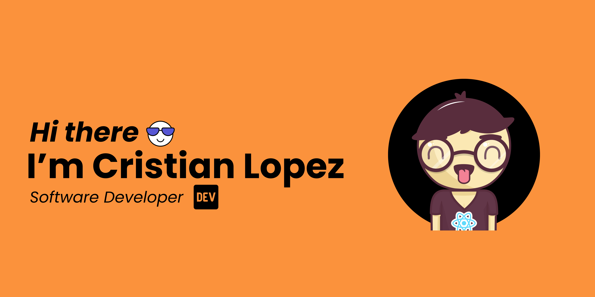
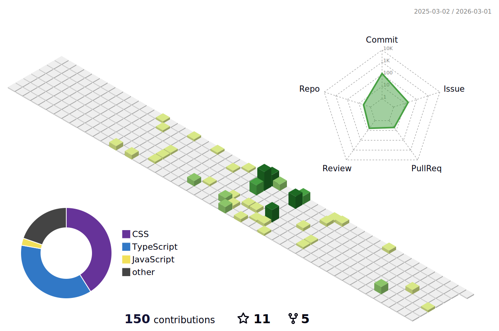

 

<h1 align="center">
    
    
 
  
  
  <a href="https://cristianlopez3.github.io/Portfolio/" target="_blank">
      <!-- sqlite, safari, google-chrome are other good icon options -->
  </a>

</h1>

## A Passionate Software Developer from Colombia 🇨🇴 

 
* 🔭 I’m currently looking for a job.
* 🌱 I’m currently learning **Kubernetes, AWS and System Design**
* 💬 Ask me about **Java, Spring, Microservices, Typescript, JavaScript, React, SQL, 
 MongoDB, MuleSoft... [ ➡️ here ⬅️](https://github.com/CristianLopez3/CristianLopez3/issues)**

**Fun fact ⚡:**
 > _The first computer known to run a program stored in its memory was the Manchester Small-Scale Experimental Machine (SSEM) or
"Baby." Its inaugural program was written to find prime numbers._
 
## My Working Stack 🧑‍💻 

 
 

 

## Stats 🌟

|   |   |  |
|-----------|-----------|-----------|

## ☄️ Contributions ☄️
    

  

<h3 align="center">
    
</h3>

 
