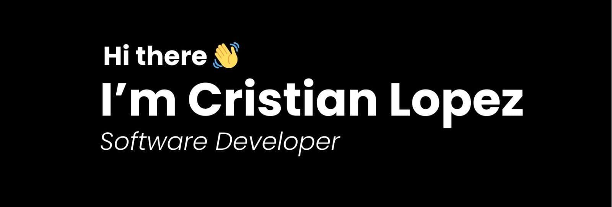
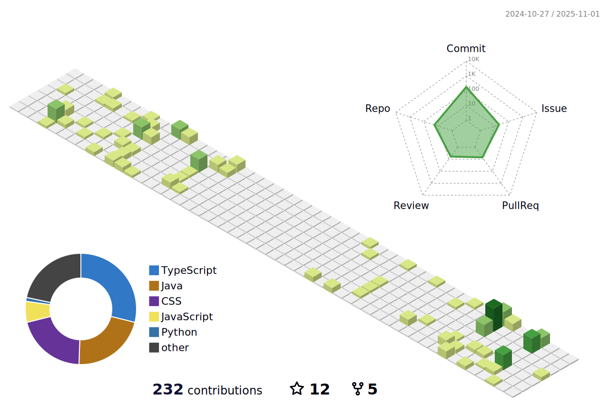

  

<h1 align="center">
    
    
 
  
  
  <a href="https://cristianlopez3.github.io/Portfolio/" target="_blank">
      <!-- sqlite, safari, google-chrome are other good icon options -->
  </a>

</h1>

## A Passionate Backend Developer from Colombia 🇨🇴 

 

 
 🔭 I’m currently working on **Personal Projects**
 
 🌱 I’m currently learning **Docker, Testing, Advanced Java**

 💬 Ask me about **Java, Spring, Typescript, JavaScript, React, SQL, 
 MongoDB... [here](https://github.com/CristianLopez3/CristianLopez3/issues)**

 ⚡ **Fun fact:**
 > The first computer known to run a program stored in its memory was the Manchester Small-Scale Experimental Machine (SSEM) or
"Baby." Its inaugural program was written to find prime numbers.

 

 

 

 
## I Work with:
 

     
     
     

 

 

<h2 align="center">🌟 Stats 🌟</h2>

|   |   |  |
|-----------|-----------|-----------|

## Contributions
    

  

<h3 align="center">
    
</h3>

 
